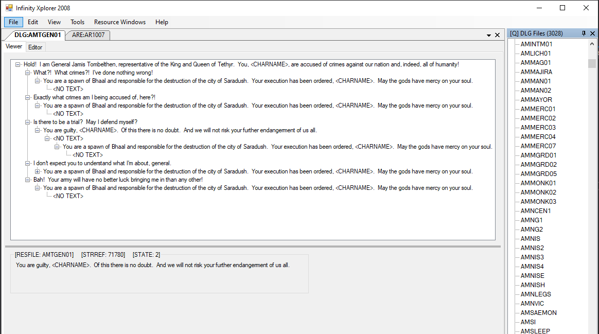

# Introductions

Game modding tool for the infinity engine:
- initially based on the infexp that was developed in Delphi Pascal. 
- re-developed in C# using Zlib & WinFormsUI

## Screenshots (v1.10)

Screenshots of the latest version.

#### Rendering ARE world maps and data. 

#### Generating dialog trees and script triggers 
